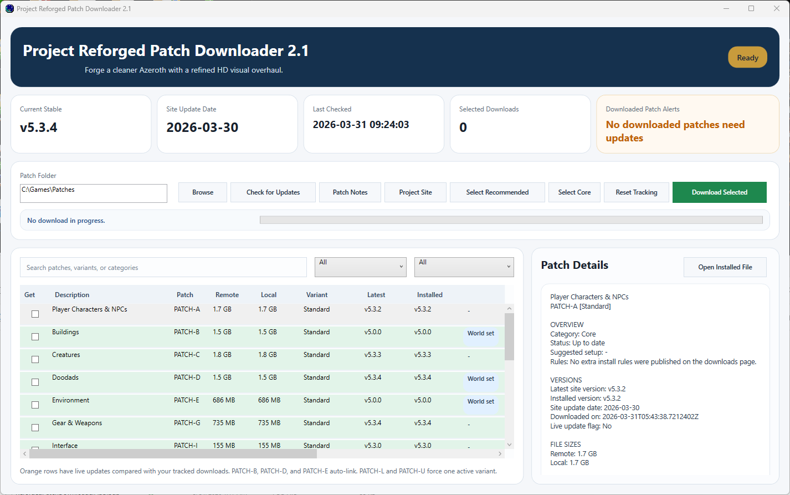
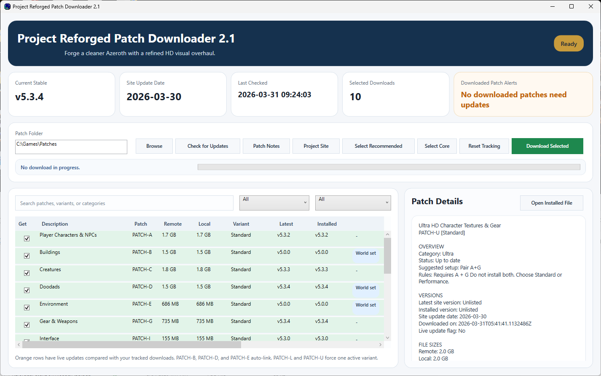

# Project Reforged Patch Downloader


> A fast Windows desktop downloader for Project Reforged patches, with live catalog checks, version tracking, and update alerts.

## Overview

Project Reforged is a modular HD visual overhaul for the World of Warcraft 1.12 client. Its module-based design is powerful, but it also means players need to keep track of patch groups, linked downloads, required dependencies, update checks, and local install state.

This app turns that workflow into a purpose-built Windows desktop experience.

It can:

- load the live patch catalog from [projectreforged.github.io](https://projectreforged.github.io/)
- show patch names, descriptions, versions, dates, and file sizes
- alert you when downloaded patches have newer live versions available
- keep linked patches synchronized automatically
- help you avoid conflicting variant selections
- download directly into your patch folder with visible queue progress

## Screenshots

### Patch library and update-aware browsing



### Selected patch set and details panel



## Key Features

- Live catalog refresh from the Project Reforged website
- Search and filter tools for descriptions, patch ids, variants, and status
- Update highlighting for tracked local downloads
- Byte-aware download progress with queue position and active file details
- Clean stop support for active downloads
- Exit warning while a download is in progress
- Clickable `What Changed` panel that jumps to updated patches
- `Open Installed File` action for the selected patch
- Local manifest tracking using `.project-reforged-manifest-v2.json`
- Saved folder path, selected patches, and grid column widths between launches

## Smart Rules

The app includes a few guardrails so users do not have to memorize every patch rule:

- `PATCH-B`, `PATCH-D`, and `PATCH-E` stay linked together
- `PATCH-L` only allows one active variant at a time
- `PATCH-U` only allows one active variant at a time
- dependency-heavy patches can prompt to auto-select required modules
- `Select Recommended` applies a strong baseline preset quickly

## Status Tracking

Each patch row can show:

- not downloaded
- downloaded
- up to date
- update available
- other variant installed

Rows with live updates are highlighted so they stand out immediately.

## Tech Stack

- C#
- .NET 10
- WPF
- `HttpClient`
- `System.Text.Json`

## Runtime Requirement

This release build requires the Windows `.NET 10 Desktop Runtime` to be installed.

If `ReforgedPatchDownloaderApp.exe` does not start on a machine, install the current `.NET Desktop Runtime` for Windows and try again.

## Project Layout

- `src/` - WPF UI, models, downloader service, settings store
- `assets/` - application icon and related assets
- `docs/screenshots/` - README screenshots

## Building

Install the .NET 10 SDK, then run:

```powershell
dotnet build .\ReforgedPatchDownloaderApp.csproj
```

## Release Files

The packaged `v2.1` release includes:

- `ReforgedPatchDownloaderApp.exe`
- `ReforgedPatchDownloaderApp.dll`
- `ReforgedPatchDownloaderApp.deps.json`
- `ReforgedPatchDownloaderApp.runtimeconfig.json`
- `README.md`
- `RELEASE-README.txt`
- `RELEASE-NOTES-v2.1.md`
- `docs/screenshots/app-v2.1-library.png`
- `docs/screenshots/app-v2.1-selected.png`

## Official Project Links

- Project site: [projectreforged.github.io](https://projectreforged.github.io/)
- Downloads: [projectreforged.github.io/downloads](https://projectreforged.github.io/downloads/)
