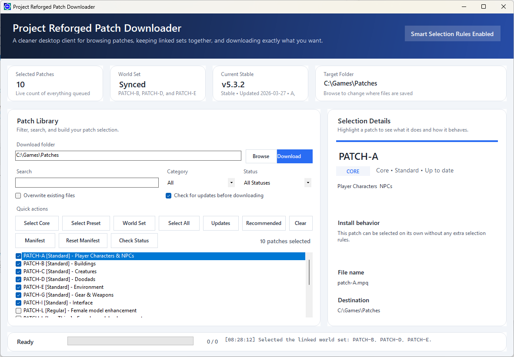
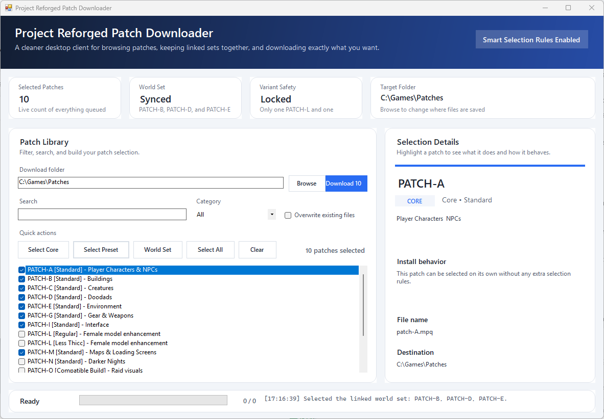

# Project Reforged Patch Downloader


> An unofficial patch downloader for Project Reforged on Windows.

## Why This Exists

Project Reforged describes itself as a "carefully curated high-definition visual overhaul" for the World of Warcraft 1.12 client, designed to preserve the original artistic identity while improving visual fidelity, stability, and immersion.

That modular approach is powerful, but it also means users need to keep track of:

- which modules exist
- which patches belong together
- which variants should not be installed at the same time
- where each file needs to go

This app turns that process into a cleaner Windows experience:

- browse the patch library in a dedicated GUI
- search and filter the list quickly
- auto-handle linked patch groups
- prevent conflicting variant selections
- download directly into your chosen patch folder

## About Project Reforged

Project Reforged is a long-term visual overhaul project for the WoW 1.12 client. According to the official site, it focuses on raising visual fidelity without sacrificing the atmosphere of the original game.

The site currently lists:

- Current stable version: `v5.3.2`
- Release status: `Stable`
- Updated: `2026-03-27`
- Recently updated modules: `A`, `C`, `O`, `U`, `V`

The project is presented as a modular architecture built around optional patch modules such as:

- `PATCH-A` for player characters and NPCs
- `PATCH-B`, `PATCH-D`, and `PATCH-E` for the world and environment
- `PATCH-C` for creatures
- `PATCH-G` for gear and weapons
- `PATCH-I` for interface updates
- `PATCH-M` for maps and loading screens
- `PATCH-O` for raid visuals
- `PATCH-S` for sounds and music
- `PATCH-U` for Ultra HD character textures
- `PATCH-V` for spell visual effects

This downloader is meant to make working with those modules easier.

## Screenshots

### Clean desktop layout



### Preset selection in action



## Features

| Area | What it does |
| --- | --- |
| Patch browsing | Shows the available patches in a searchable, filterable desktop list |
| Smart selection | Automatically keeps `PATCH-B`, `PATCH-D`, and `PATCH-E` linked together |
| Variant safety | Only allows one `PATCH-L` variant and one `PATCH-U` variant at a time |
| Detail panel | Explains what a patch does, what rules apply, and where it will be saved |
| Download workflow | Downloads directly to your selected folder and can skip or overwrite existing files |
| Presets | Includes quick actions for core patches, linked world set, and a ready-made preset |

## Smart Rules

The app includes guardrails to make patch selection easier and safer:

- Checking one of the linked world patches auto-selects the others in that set
- Only one `PATCH-L` variant can stay selected at a time
- Only one `PATCH-U` variant can stay selected at a time
- Compatibility warnings appear before download when a patch is usually paired with another patch

## Installation Notes From Project Reforged

The official Project Reforged page calls out a few important setup rules that this app tries to respect:

- `PATCH-B`, `PATCH-D`, and `PATCH-E` should be installed together
- `PATCH-L` requires `PATCH-A`
- `PATCH-U` requires `PATCH-A` and `PATCH-G`
- `VanillaHelpers` is listed as mandatory on the official site
- `DXVK` is strongly recommended on the official site

This downloader currently focuses on the patch modules themselves and does not bundle external dependencies.

## Quick Start

1. Launch `ReforgedPatchDownloaderApp.exe`
2. Browse, search, or filter the patch list
3. Choose a destination folder if you do not want the default
4. Click `Download`

## Default Download Location

```text
C:\Games\Patches
```

## Release Contents

- `ReforgedPatchDownloaderApp.exe`
- `README.md`

## Build Notes

Source files in this folder:

- `ProgramModern.cs` - current polished WinForms app
- `Program.cs` - earlier version kept for reference
- `build.bat` - local build script

## Status

This is a working Windows release build and is ready to use as a standalone Project Reforged patch downloader.

## Official Project Links

- Project site: [projectreforged.github.io](https://projectreforged.github.io/)
- Downloads: [projectreforged.github.io/downloads](https://projectreforged.github.io/downloads/)
- Discord: [Project Reforged Discord](https://discord.gg/jnvkayMbqJ)
